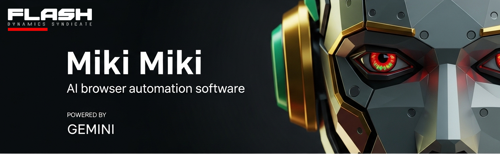

[](https://www.python.org/downloads/)
[](LICENSE)
[](https://github.com/29ayx/miki-miki)
[](https://ai.google.dev/)

# 🤖 Miki Miki - AI-Powered Browser Automation with Gemini Vision

An intelligent, autonomous web browser automation tool powered by Google's Gemini Vision AI. This AI can see, think, and act independently to accomplish complex web tasks without human intervention.

**Developed by [Flash Dynamics Syndicate](https://fdsyd.com)**

## ✨ Features

### 🧠 **Intelligent AI Agent**
- **Vision-Based Understanding**: Uses Gemini Vision AI to "see" and understand web pages
- **Autonomous Decision Making**: Makes intelligent decisions without human confirmation
- **Natural Language Goals**: Accept goals in plain English (e.g., "search for Python tutorials on Google")
- **Persistent Task Completion**: Continues working until the goal is actually achieved

### 🎯 **Smart Problem Solving**
- **Obstacle Detection**: Automatically detects CAPTCHAs, login prompts, popups, and other barriers
- **Intelligent Solutions**: Asks Gemini to analyze problems and provide specific solutions
- **Adaptive Strategies**: Learns from failures and improves over time
- **Multi-Step Planning**: Breaks down complex tasks into executable actions

### 📚 **Machine Learning Integration**
- **Learning from Mistakes**: Records and analyzes failed attempts
- **Success Rate Tracking**: Monitors performance across different websites
- **Improvement Suggestions**: Provides insights for better future performance
- **Pattern Recognition**: Identifies common obstacles and successful strategies

### 🌐 **Supported Tasks**
- **Search Operations**: Google, YouTube, Amazon, and other search engines
- **Video Playback**: YouTube video finding and playing
- **E-commerce**: Product searches and navigation
- **Social Media**: Navigation and interaction
- **Authentication**: Login flows and verification
- **Form Filling**: Email inputs, search boxes, and more


https://github.com/user-attachments/assets/def00fde-7388-4809-93e1-62c68edbab0a


## 🚀 Quick Start

### Prerequisites
- Python 3.8 or higher
- Google Chrome browser
- ChromeDriver (automatically managed by Selenium)
- Google Gemini API key

### Installation

1. **Clone the repository**
   ```bash
   git clone https://github.com/29ayx/miki-miki.git
   cd miki-miki
   ```

2. **Create a virtual environment**
   ```bash
   python3 -m venv venv
   source venv/bin/activate  # On Windows: venv\Scripts\activate
   ```

3. **Install dependencies**
   ```bash
   pip install -r requirements.txt
   ```

4. **Set up Gemini API Key**
   
   **Get your API key:**
   - Visit [Google AI Studio](https://makersuite.google.com/app/apikey)
   - Create a new API key
   - Copy the key

   **Configure the key:**
   - Open `main.py`
   - Go to **line 59**
   - Replace `"Your Gemini api key goes here..."` with your actual API key:
   ```python
   GEMINI_API_KEY = "your-actual-gemini-api-key-here"
   ```

5. **Run Miki Miki**
   ```bash
   python main.py
   ```

## 📋 Requirements

### Python Dependencies
```
selenium==4.15.2
Pillow==10.0.1
requests==2.31.0
google-generativeai==0.8.5
```

### Gemini API Requirements
- **Model**: Uses `gemini-1.5-flash` for vision and text generation
- **Rate Limits**: Standard Gemini API limits apply
- **Cost**: Pay-per-use pricing (very affordable for typical usage)
- **Features**: Requires vision capabilities for screenshot analysis

### System Requirements
- **OS**: Windows, macOS, or Linux
- **Browser**: Google Chrome (latest version recommended)
- **Memory**: 4GB RAM minimum, 8GB recommended
- **Storage**: 1GB free space

## 🎯 Usage Examples

### Basic Commands
```bash
# Start Miki Miki
python main.py

# Example goals you can give the AI:
"search for Python tutorials on Google"
"go to YouTube and find funny videos"
"navigate to Amazon and search for laptops under $500"
"open Google and search for hello world"
```

### Advanced Usage
```bash
# View AI learning insights
Type "learn" or "insights" when prompted for a goal

# Exit the application
Type "quit" or "exit" when prompted for a goal
```

## 🔧 Configuration

### API Key Location
The Gemini API key is configured in `main.py` at **line 59**:
```python
GEMINI_API_KEY = "your-api-key-here"
```

### Chrome Options
The browser is configured with anti-detection features:
- Disabled automation indicators
- Maximized window
- Stealth mode enabled

### Learning Data
The AI learning system stores data in `ai_learning_data.json`:
- Task success/failure patterns
- Element interaction failures
- Website-specific strategies
- Common mistake analysis

## 🧠 How It Works

### 1. **Goal Understanding**
- AI receives natural language goal
- Analyzes current page state
- Plans required actions

### 2. **Vision-Based Analysis**
- Captures page screenshots
- Uses Gemini Vision to understand content
- Identifies interactive elements

### 3. **Intelligent Action Planning**
- Generates specific action sequences
- Handles complex multi-step tasks
- Adapts to page changes

### 4. **Problem Solving**
- Detects obstacles (CAPTCHAs, popups, etc.)
- Analyzes problems with Gemini
- Implements targeted solutions

### 5. **Learning & Improvement**
- Records all attempts and outcomes
- Analyzes failure patterns
- Suggests improvements for future tasks

## 🛠️ Troubleshooting

### Common Issues

**"ChromeDriver not found"**
- ChromeDriver is automatically managed by Selenium
- Ensure Chrome browser is installed and up to date

**"Gemini API error"**
- Verify your API key is correct at line 59
- Check your internet connection
- Ensure you have sufficient API quota

**"Element not found"**
- The AI will automatically retry with different strategies
- Check if the website structure has changed
- Use the learning insights to see common failures

**"CAPTCHA detected"**
- The AI will automatically detect and attempt to solve CAPTCHAs
- Some CAPTCHAs may require human intervention
- The AI will provide specific instructions for manual solving

### Performance Tips
- Use a stable internet connection
- Close unnecessary browser tabs
- Ensure sufficient system resources
- Monitor API usage to avoid rate limits

## 📊 Learning System

The AI continuously learns and improves:

### **Learning Data**
- Task completion rates
- Element interaction success rates
- Website-specific patterns
- Common failure modes

### **Insights Available**
- Success rate statistics
- Common mistake analysis
- Website-specific strategies
- Improvement suggestions

### **Accessing Insights**
Type `learn` or `insights` when prompted for a goal to see:
- Overall performance metrics
- Common obstacles encountered
- Successful strategies used
- Recommendations for improvement

## 🔒 Security & Privacy

### **Data Handling**
- Screenshots are stored locally and deleted after analysis
- Learning data is stored locally in JSON format
- No personal data is sent to external services

### **API Security**
- API key is stored locally in the code
- No sensitive data is logged or transmitted
- All communications use HTTPS

### **Browser Security**
- Uses isolated browser session
- No access to user's personal browser data
- Runs in controlled environment

## 🤝 Contributing

**Miki Miki is proudly open source!** We welcome contributions from the community to make this AI browser automation tool even better.

### 🚀 **Quick Start for Contributors**
1. **Fork the repository**
2. **Create a feature branch**: `git checkout -b feature/amazing-feature`
3. **Make your changes**
4. **Test thoroughly**
5. **Submit a pull request**

### 🎯 **Areas for Improvement**
- **🐛 Bug fixes and improvements**
- **✨ New features and enhancements**
- **📚 Documentation improvements**
- **🧪 Tests and quality assurance**
- **🌐 Additional website support**
- **🤖 AI model integrations**
- **⚡ Performance optimizations**
- **🔒 Security enhancements**

### 🌟 **Community Guidelines**
- Be respectful and inclusive
- Follow the existing code style
- Test your changes thoroughly
- Provide clear commit messages
- Help others in the community

**📖 See [CONTRIBUTING.md](CONTRIBUTING.md) for detailed guidelines!**
**🤝 See [CODE_OF_CONDUCT.md](CODE_OF_CONDUCT.md) for community standards!**

## 📄 License

This project is licensed under the MIT License - see the [LICENSE](LICENSE) file for details.

## 🙏 Acknowledgments

- **[Flash Dynamics Syndicate](https://fdsyd.com)** for developing Miki Miki
- **Google Gemini AI** for providing the vision and language capabilities
- **Selenium** for browser automation framework
- **OpenAI** for inspiration in AI agent design
- **Open Source Community** for various supporting libraries

## 📞 Support

### **Issues**
- Report bugs via GitHub Issues
- Include screenshots and error messages
- Describe the steps to reproduce

### **Questions**
- Check the troubleshooting section
- Review existing issues
- Create a new issue for questions

### **Feature Requests**
- Use GitHub Issues for feature requests
- Describe the desired functionality
- Explain the use case

---

## 🌟 **Open Source Community**

**Miki Miki is proudly open source and community-driven!** 

### 🤝 **Join Our Community**
- **⭐ Star this repository** if you find it useful
- **🐛 Report bugs** via GitHub Issues
- **💡 Suggest features** through discussions
- **🔧 Contribute code** via pull requests
- **📚 Improve documentation** and examples
- **🌐 Share your use cases** and success stories

### 🏆 **Contributor Recognition**
All contributors will be recognized in:
- Project README contributors section
- Release notes and changelog
- GitHub contributors page
- Community hall of fame

### 📈 **Project Goals**
- **Democratize AI automation** - Make AI browser automation accessible to everyone
- **Foster innovation** - Encourage creative uses and improvements
- **Build community** - Create a supportive ecosystem of developers and users
- **Continuous improvement** - Learn from community feedback and contributions

**Together, we can make Miki Miki the most powerful AI browser automation tool! 🚀**

---

**⭐ Star this repository if you find it useful!**

**🤖 Happy Miki Miki browsing!**
